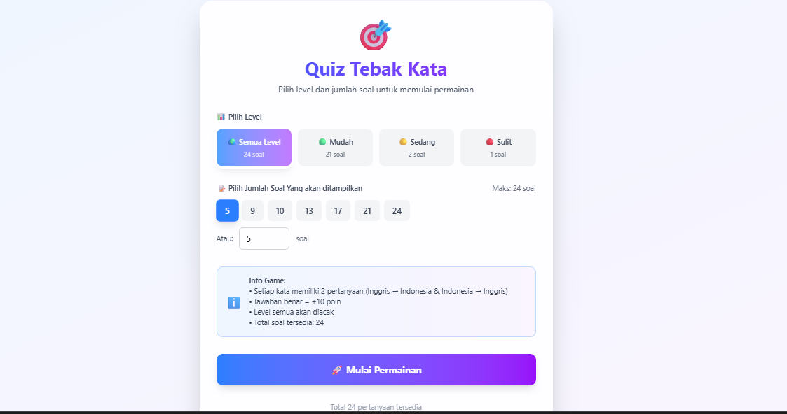

# game iseng aja si gak lebih dari itu

```text
dibuat dengan react js, dan data dari json

untuk menambahkan json disini

data/words.json

atau lewat link admin
localhost:5173/admin

tambahkan lalu export dan timpa file words.json
```

# 🎯 Quiz Tebak Kata - Interactive Word Guessing Game



## 📌 Deskripsi
Aplikasi web interaktif untuk belajar kosakata bahasa Inggris melalui permainan tebak kata. Dilengkapi dengan sistem manajemen data untuk admin.

## ✨ Fitur

### 🎮 Untuk Pengguna
- 3 level kesulitan (Mudah, Sedang, Sulit)
- Pertanyaan bilingual (Indonesia ↔ Inggris)
- Sistem scoring dan statistik
- Progress tracking
- Responsive design

### 🔧 Untuk Admin
- CRUD data kata
- Import/Export JSON
- Filter dan pencarian
- Validasi data

## 🛠️ Tech Stack
- **Frontend**: React 18, TypeScript, Tailwind CSS
- **Build Tool**: Vite
- **State Management**: React Hooks
- **Storage**: LocalStorage
- **SEO**: Meta tags, Open Graph, Schema.org

## 🚀 Demo
[Live Demo](https://akmadnudin.com/minigame)

## 📦 Instalasi

```bash
# Clone repository
git clone https://github.com/adex-dev/minigame.git

# Install dependencies
npm install
### or

bun install

# Jalankan development
npm run dev
### or

bun run dev

# Build untuk production
npm run build
### or

bun run build